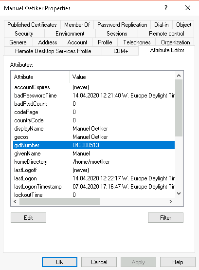
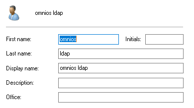

## Active Directory Integration

OmniOS can integrate itself into an active directory domain as an smb file server and it can use an active directory server for both login authentication as well as to provide name services for user accounts.

### Preparing the System

Use AD as your dns server

```terminal
# cat <<CFG_END >/etc/resolv.conf
nameserver 10.1.1.1
domain my-ad-domain.local
search my-ad-domain.local
CFG_END
```

Enable ntp as precise time is essential for kerberos operation.

```terminal
# svcadm enable network/ntp
```

### Hooking up Kerberos

Install Kerberos support

```terminal
# pkg install system/security/kerberos-5
```

Setup Kerberos for MS Active Directory (ms_ad)

```terminal
# kclient -T ms_ad          
# kinit -V administrator         
```

### Enabeling SMB Filesharing

To make sure we have the same user id numbers everywhere we want to keep them in Active Direcory. 

```terminal
# svccfg -s svc:/system/idmap setprop \ config/directory_based_mapping=astring: idmu
# svcadm refresh svc:/system/idmap
```

Make sure you have the following properties configured for every user in your active directory:

    * uid (username)
    * uidNumber 
    * gitNumber
    * homeDirectory
    * loginShell
    * gecos



```terminal
# sharectl set -p lmauth_level=5 smb
# sharectl set -p system_comment="My Funny Fileserver" smb
# svcadm enable -r smb/server
```

### Name Service Integration

The illumos active directory plugin does not support full login integration, therefore we have to setup a proxy ldap user and then configure the ldap client to enable unix logins with ldap accounts. The proxy AD user has to have appropriate rights to read the the user account entries.



Now configure the ldap client accordinly

```terminal
ldapclient manual \
    -a credentialLevel=proxy \
    -a authenticationMethod=simple \
    -a proxyDN="cn=omnios ldap,cn=Users,dc=my-ad-domain,dc=local" \
    -a proxyPassword=Plain Password \
    -a defaultSearchBase=dc=my-ad-domain,dc=local \
    -a domainName=my-ad-domain.local \
    -a followReferrals=false" \
    -a defaultServerList=ad.my-ad-domain.local \
    -a attributeMap=group:userpassword=userPassword \
    -a attributeMap=group:memberuid=memberUid \
    -a attributeMap=group:gidnumber=gidNumber \
    -a attributeMap=passwd:gecos=gecos \
    -a attributeMap=passwd:gidnumber=gidNumber \
    -a attributeMap=passwd:uidnumber=uidNumber \
    -a attributeMap=passwd:homedirectory=HomeDirectory \
    -a attributeMap=passwd:loginshell=loginShell \
    -a attributeMap=shadow:shadowflag=shadowFlag \
    -a attributeMap=shadow:userpassword=userPassword \
    -a objectClassMap=group:posixGroup=group \
    -a objectClassMap=passwd:posixAccount=user \
    -a objectClassMap=shadow:shadowAccount=user \
    -a serviceSearchDescriptor=passwd:dc=my-ad-domain,dc=local?sub \
    -a serviceSearchDescriptor=group:dc=my-ad-domain,dc=local?sub
```

Make sure that `/etc/nsswitch.conf` only has `ldap` entries for `passwd` and `group` plus `dns` for `hosts`:

```
# ...
passwd:     files ldap ad
group:      files ldap ad
# ...
hosts:      files dns
ipnodes:    files dns
# ...
```

Finally pam must be told to use kerberos where appropriate via `/etc/pam.conf` the entries are most likely already present you just have to remove the comment character `#`. See `man pam_krb5` for details.

```
login   auth sufficient         pam_krb5.so.1
krlogin auth required           pam_krb5.so.1
krsh    auth required           pam_krb5.so.1
ktelnet auth required           pam_krb5.so.1
other   auth sufficient         pam_krb5.so.1
```


### Testing

Your OmniOS server should now be accessible as smb fileserver from windows clients allowing for SSO access.

On the omnios command line you should see all accounts using with `getent passwd` just create appropriate home directories and chown them to the users.


### Thanks

Thanks to [Manuel Oetiker](https://manuel.oetiker.ch) for help in figuring this all out.

If you have any have input on how to improve this setup or the documentation, please be in [touch](/about/contact.html).
